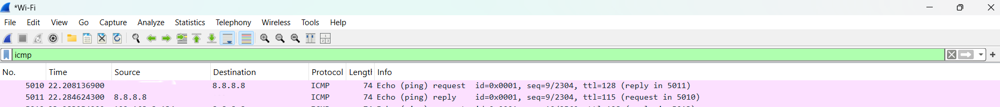
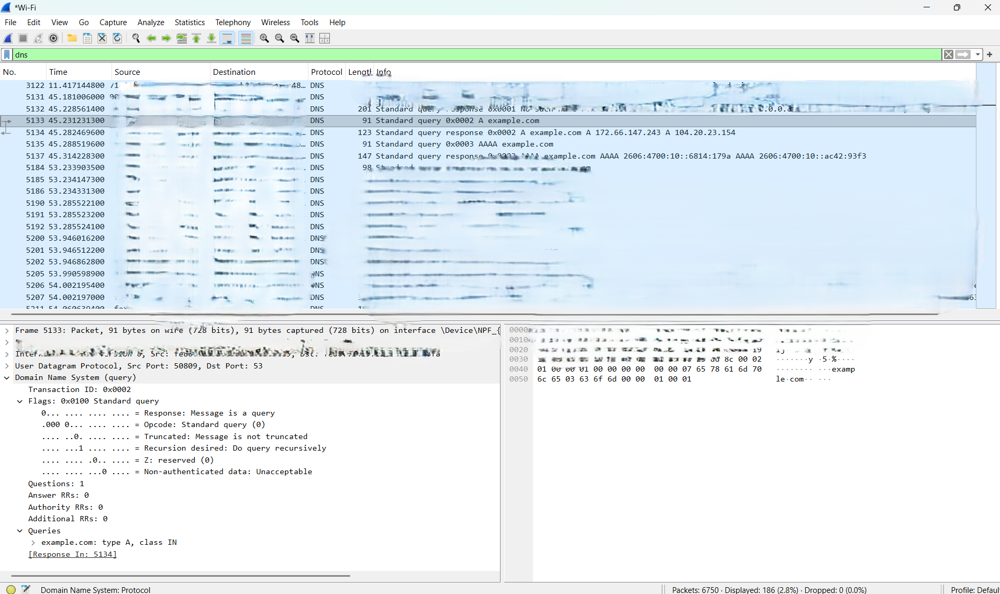
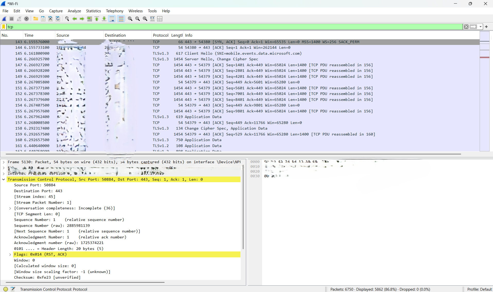
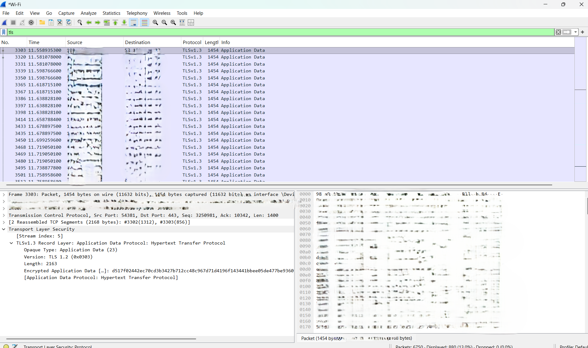

# Week 2 - Networking Fundamentals and Wireshark Lab

## Introduction

This week's practical exercise focused on understanding basic network communication and observing network traffic using Wireshark. The main protocols investigated were ICMP, DNS, TCP, and TLS/HTTPS.

The practical was performed using my own computer and normal network traffic. The purpose was to understand how devices communicate, how domain names are resolved, how TCP connections are established, and what information can still be observed when HTTPS traffic is encrypted.

## Objectives

The objectives of this practical were to:

* Understand IP addresses and MAC addresses.
* Understand TCP and UDP.
* Understand common network ports and services.
* Understand DNS and domain-name resolution.
* Understand HTTP and HTTPS.
* Understand ICMP and the ping command.
* Identify the TCP three-way handshake.
* Use Wireshark to capture and analyse network traffic.
* Understand source and destination IP addresses and ports.
* Understand the difference between capture filters and display filters.

## Lab Environment

### Tools Used

* Windows computer
* Wireshark
* Command Prompt / PowerShell
* Web browser
* Internet connection

### Traffic Generated

The following traffic was generated during the experiment:

```text
ICMP:
ping 8.8.8.8

DNS:
nslookup example.com

HTTPS:
Visited an HTTPS website using a web browser
```

The Wireshark capture was performed on my active network interface.

## Basic Networking Concepts

### IP Address

An IP address identifies a device or network interface at the network layer and allows packets to be routed between networks.

For example:

```text
192.168.1.10
```

In a packet capture, the Source and Destination fields identify where a packet originated and where it is being sent.

### MAC Address

A MAC address identifies a network interface at the data-link layer. It is mainly used for communication within the local network.

A MAC address can appear in a format such as:

```text
AA:BB:CC:DD:EE:FF
```

### TCP and UDP

TCP is connection-oriented and provides reliable, ordered communication. It establishes a connection before transferring application data.

UDP is connectionless and has less protocol overhead. It is commonly used for services such as DNS and for applications where low overhead is important.

### Common Ports

| Port | Common Service | Purpose                         |
| ---: | -------------- | ------------------------------- |
|   22 | SSH            | Secure remote access            |
|   53 | DNS            | Domain-name resolution          |
|   80 | HTTP           | Unencrypted web traffic         |
|  443 | HTTPS          | Web traffic protected using TLS |

### ICMP

ICMP is a network-layer control and diagnostic protocol. The `ping` command commonly uses ICMP Echo Request and Echo Reply messages to test connectivity.

### DNS

DNS stands for Domain Name System. It translates domain names into IP addresses so that users and applications can use human-readable names while network communication can use IP addresses.

### HTTP and HTTPS

HTTP commonly uses port 80 and does not provide TLS encryption by itself.

HTTPS commonly uses port 443 and uses TLS to protect application data while it is transmitted.

---

# ICMP Traffic Analysis

## Traffic Generation

I generated ICMP traffic using:

```text
ping 8.8.8.8
```

After running the command, I applied the following Wireshark display filter:

```text
icmp
```

## ICMP Observation

The capture contained an ICMP Echo Request and a corresponding Echo Reply.

### Echo Request

```text
Source IP:      [MY IP]
Destination IP: 8.8.8.8
ICMP Type:      Echo Request
Packet Number:  [5010]
```

### Echo Reply

```text
Source IP:      8.8.8.8
Destination IP: [MY IP]
ICMP Type:      Echo Reply
Packet Number:  [5011 ]
```

The Echo Request was sent from my computer to the destination, and the Echo Reply was returned from the destination to my computer.

### Screenshot



## Interpretation

The ICMP packets demonstrate a basic request-and-response communication pattern. The source and destination addresses are reversed between the Echo Request and Echo Reply.

---

# DNS Traffic Analysis

## Traffic Generation

I generated DNS traffic using:

```text
nslookup example.com
```

I then applied the Wireshark display filter:

```text
dns
```

## DNS Observation

The DNS query requested the address information for:

```text
example.com
```

The observed DNS information was:

```text
Queried domain:       example.com
DNS server:           [DNS SERVER FROM CAPTURE]
Returned address:     [ADDRESS FROM CAPTURE]
Query packet number:  [PACKET NUMBER]
Response packet number: 5133
```

### Screenshot



## Domain-Name Resolution

The DNS process observed during the experiment can be represented as:

```text
Computer
   |
   | DNS Query:
   | "What address belongs to example.com?"
   v
DNS Server
   |
   | DNS Response:
   | "Here is the requested address."
   v
Computer
```

DNS is important because users and applications can use domain names such as `example.com` instead of having to remember numerical IP addresses.

After receiving the required address information, the computer can use that information to communicate with the destination.

---

# TCP Traffic Analysis

## TCP Connection

I examined TCP traffic generated during the HTTPS connection.

The following display filter was used:

```text
tcp
```

A TCP connection was identified using destination port:

```text
443
```

## TCP Three-Way Handshake

TCP establishes a connection using three main steps:

```text
Client                         Server

SYN ------------------------->

     <---------------- SYN/ACK

ACK ------------------------->
```

### Captured Packets

| Packet | Packet Number | Source Port | Destination Port | Flags    | Direction       |
| ------ | ------------: | ----------: | ---------------: | -------- | --------------- |
| 1      |      [141] |      [50884] |              443 | SYN      | Client → Server |
| 2      |      [142] |         443 |           [50884] | SYN, ACK | Server → Client |
| 3      |      [143] |      [50884] |              443 | ACK      | Client → Server |

### Screenshot



## Interpretation

The first packet contains the SYN flag and represents the client's request to establish a TCP connection.

The second packet contains SYN and ACK flags. It represents the server's response and acknowledgement of the client's request.

The third packet contains the ACK flag and confirms the connection from the client side.

After this process, the TCP connection can be used for communication.

---

# TLS/HTTPS Traffic Analysis

## HTTPS Traffic

I opened an HTTPS website using a web browser while Wireshark was capturing traffic.

The following display filter was used:

```text
tls
```

The capture showed TLS-related packets associated with HTTPS communication.

### Observed Information

```text
Protocol:       TLS
Destination Port: 443
TLS information: [OBSERVED TLS INFORMATION]
Packet Number:  [3303]
```

### Screenshot



## Visible Metadata

Although HTTPS protects application data using TLS encryption, some network and protocol metadata can still be observed.

Examples include:

* Source IP address
* Destination IP address
* Source port
* Destination port
* Packet size
* Packet timing
* TLS-related handshake information
* TLS version, when exposed in the capture

The actual protected application data cannot normally be read directly from the capture without the required decryption information.

Therefore, HTTPS does not make network traffic completely invisible. Instead, TLS protects the confidentiality and integrity of the application data being transmitted.

---

# Packet Observation Table

The following table summarises selected packets from the capture.

| Packet No. | Protocol | Source       | Destination  | Ports        | Interpretation    |
| ---------: | -------- | ------------ | ------------ | ------------ | ----------------- |
|      [NO.5010] | ICMP     | [MY IP]    | 8.8.8.8      | N/A          | Echo Request      |
|      [NO.5011] | ICMP     | 8.8.8.8      | [MY IP]    | N/A          | Echo Reply        |
|      [NO.5133] | DNS      | [MY IP]    | [DNS SERVER] | [PORT] → 53     | DNS Query         |
|      [NO.5134] | DNS      | [DNS SERVER] | [MY IP]    | 53 → [PORT]       | DNS Response      |
|      [NO.] | TCP      | [MY IP]    | [SERVER IP]  | [PORT] → 443 | SYN               |
|      [NO.] | TCP      | [SERVER IP]  | [MY IP]    | 443 → [PORT] | SYN/ACK           |
|      [NO.] | TCP      | [MY IP]    | [SERVER IP]  | [PORT] → 443 | ACK               |
|      [NO.] | TLS      | [MY IP]    | [SERVER IP]  | [PORT] → 443 | TLS communication |

The values in this table were taken from the selected packets in the Wireshark capture.

---

# Questions and Answers

## Question 1: ICMP

### Identify an Echo Request and Echo Reply. What are the source and destination IP addresses?

The Echo Request was sent from my computer to `8.8.8.8`.

```text
Echo Request:
Source:      [MY CAPTURED IP]
Destination: 8.8.8.8
```

The Echo Reply travelled in the opposite direction.

```text
Echo Reply:
Source:      8.8.8.8
Destination: [MY CAPTURED IP]
```

This demonstrates the request-and-response behaviour of ICMP.

---

## Question 2: DNS

### Which domain was queried? Which DNS server received it? What address was returned?

The domain queried during the experiment was:

```text
example.com
```

The DNS server observed in the capture was:

```text
[DNS SERVER]
```

The returned address observed in the DNS response was:

```text
[RETURNED ADDRESS]
```

The DNS query requested address information for the domain, and the DNS response returned the corresponding information.

---

## Question 3: TCP

### Identify source/destination ports and locate SYN, SYN/ACK and ACK packets.

The TCP connection used a temporary client-side source port and destination port 443.

The three-way handshake was:

```text
1. SYN
   [CLIENT PORT] → 443

2. SYN/ACK
   443 → [CLIENT PORT]

3. ACK
   [CLIENT PORT] → 443
```

The SYN packet initiated the connection, the SYN/ACK packet responded to the request, and the ACK packet completed the handshake.

---

## Question 4: TLS/HTTPS

### What metadata is visible even though application data is encrypted?

The capture showed information such as:

* Source and destination IP addresses
* Source and destination ports
* Packet numbers
* Packet sizes
* Timing information
* TLS handshake information
* TLS version where available

The application data itself was protected by TLS encryption, so its contents were not directly readable from the packet capture.

---

## Question 5: Capture Filter vs Display Filter

### What is the difference between a Wireshark capture filter and a display filter?

A **capture filter** controls which packets Wireshark captures during a capture session.

A **display filter** is applied after packets have been captured and controls which captured packets are displayed.

In this lab, display filters such as:

```text
icmp
dns
tcp
tls
```

were used to inspect specific types of traffic.

The main difference is:

```text
Capture filter
      ↓
Controls packets captured

Display filter
      ↓
Controls packets displayed
```

---

# Protocol Observations Summary

| Protocol | Observation                  | Purpose                           |
| -------- | ---------------------------- | --------------------------------- |
| ICMP     | Echo Request and Echo Reply  | Network connectivity/diagnostics  |
| DNS      | Query and Response           | Domain-name resolution            |
| TCP      | SYN, SYN/ACK, ACK            | Reliable connection establishment |
| TLS      | TLS communication over HTTPS | Protection of application data    |

---

# Conclusion

This practical helped me understand how normal network communication can be observed using Wireshark. I was able to identify ICMP Echo Request and Echo Reply packets, observe a DNS query and response, and identify the SYN, SYN/ACK and ACK packets used during TCP connection establishment.
