# Week 3 - Linux Foundations for Cybersecurity

## Introduction

This command journal documents the Linux commands used during the Week 3 cybersecurity practical exercise. The purpose of the exercise was to become comfortable investigating an Ubuntu Linux system from the command line.

The investigation covered user identity, filesystem navigation, network configuration, running processes, listening network ports, disk and memory usage, running services, and system logs.

All commands were executed in my Ubuntu Linux virtual machine using a normal non-root user.

---

## Environment

| Item             | Details                                               |
| ---------------- | ----------------------------------------------------- |
| Operating System | Ubuntu Linux                                          |
| Environment      | VirtualBox Virtual Machine                            |
| User Type        | Normal non-root user                                  |
| Purpose          | Linux system investigation and cybersecurity learning |

---

## 1. `whoami`

### Command

```bash
whoami
```

### Purpose

The `whoami` command displays the username of the currently logged-in user.

### Output

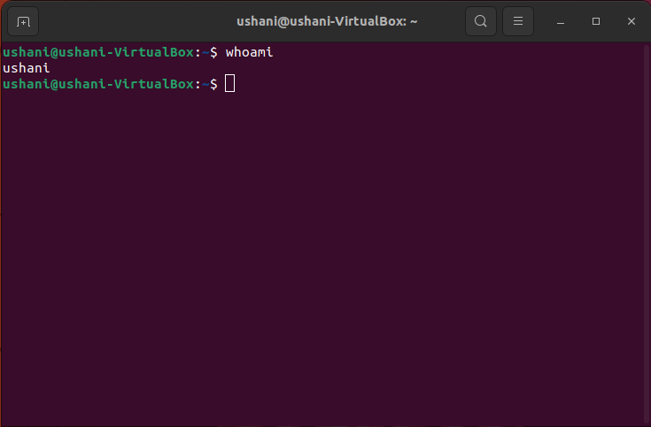

### Observation

The command identified the current user as **[ushani]**.

### What I Learned

I learned that `whoami` provides a quick way to identify the account currently being used on a Linux system. This is useful during security investigations because it establishes which user account is performing commands.

---

## 2. `pwd`

### Command

```bash
pwd
```

### Purpose

The `pwd` command means "print working directory." It displays the current location in the Linux filesystem.

### Output

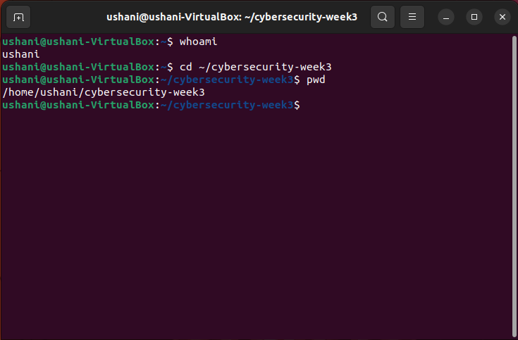

### Observation

The command showed that my current working directory was **[/home/ushani/cybersecurity-week3]**.

### What I Learned

I learned that `pwd` is useful for confirming my current location in the filesystem before creating, modifying, or investigating files.

---

## 3. `ls -la`

### Command

```bash
ls -la
```

### Purpose

The `ls -la` command displays the contents of a directory in detailed format, including hidden files.

### Output

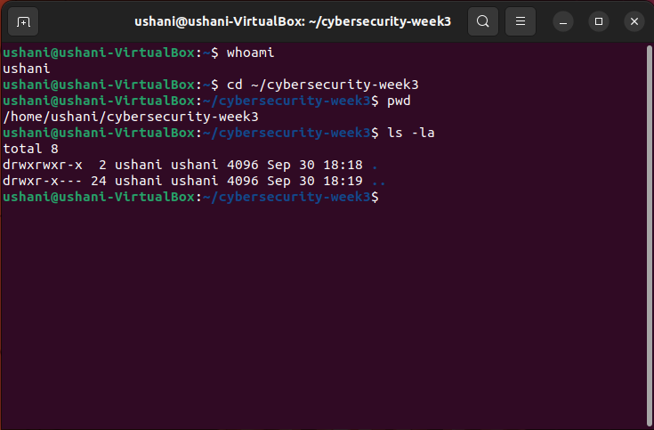

### Observation

The command displayed files and directories together with information such as permissions, ownership, file size, and modification time. Hidden files were also displayed.

### What I Learned

I learned that `ls -la` is useful for inspecting the contents and security-related properties of a directory.

---

## 4. `id`

### Command

```bash
id
```

### Purpose

The `id` command displays information about the current user's identity, including the user ID, group ID, and group memberships.

### Output

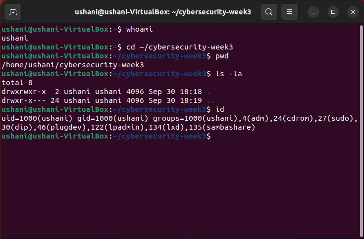

### Observation

The command showed that my user has UID **[1000(ushani)]**, GID **[1000(ushani)]**, and belongs to the groups **[1000(ushani),4(adm),24(cdrom),27(sudo),30(dip),46(lugdev),122(lpadmin),134(lxd),135(sambashare)]**.

### What I Learned

I learned that Linux uses user IDs and group memberships to manage identity and access permissions.

---

## 5. `ip addr`

### Command

```bash
ip addr
```

### Purpose

The `ip addr` command displays network interfaces and their IP address information.

### Output

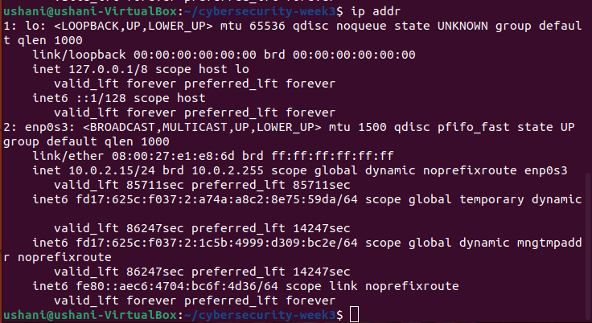

### Observation

The Ubuntu VM's active network interface was **[enp0s3]** and its IP address was **[10.0.2.15]**.

### What I Learned

I learned that `ip addr` can be used to investigate the network interfaces and IP addresses configured on a Linux system.

---

## 6. `ip route`

### Command

```bash
ip route
```

### Purpose

The `ip route` command displays the system's routing table and shows how network traffic is routed.

### Output

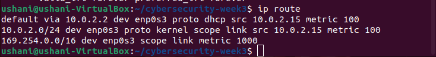

### Observation

The default route was through **[10.0.2.2]** using the **[enp0s3]** network interface.

### What I Learned

I learned that the routing table determines where network traffic is sent when there is no more specific route available.

---

## 7. `ps aux`

### Command

```bash
ps aux
```

### Purpose

The `ps aux` command displays information about currently running processes.

### Output

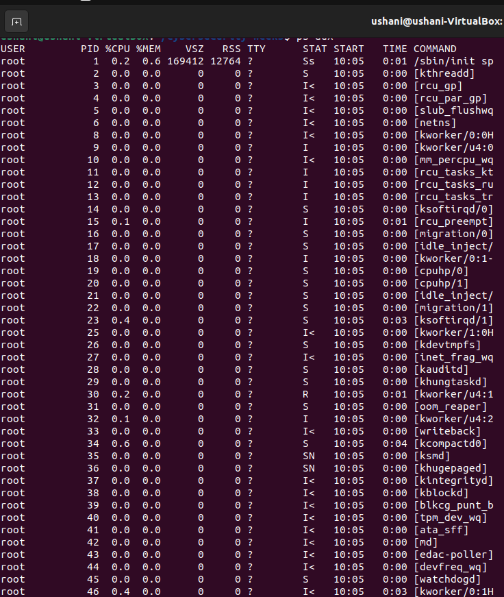
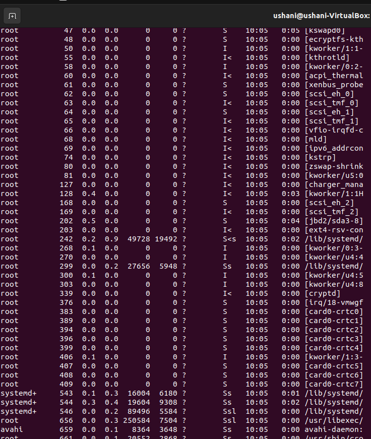

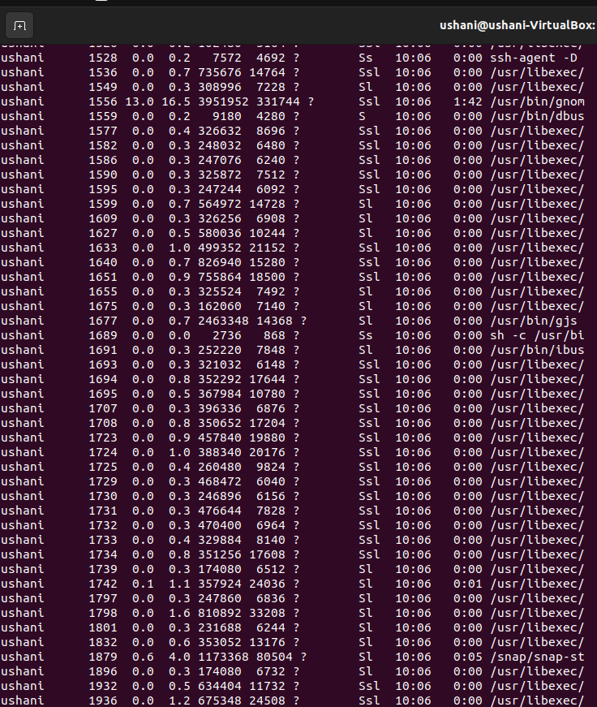

### Observation

Several processes were running on the Ubuntu VM. Examples I observed were:

* **[PROCESS 1]**
* **[PROCESS 2]**
* **[PROCESS 3]**
* **[PROCESS 4]**

The output also included information such as the process owner, process ID, CPU usage, memory usage, and command.

### What I Learned

I learned that `ps aux` can be used to investigate running processes and identify which users own them and how system resources are being used.

---

## 8. `ss -tuln`

### Command

```bash
ss -tuln
```

### Purpose

The `ss -tuln` command displays network sockets that are listening for connections.

The options mean:

* `-t` - TCP sockets
* `-u` - UDP sockets
* `-l` - listening sockets
* `-n` - display numerical addresses and port numbers

### Output

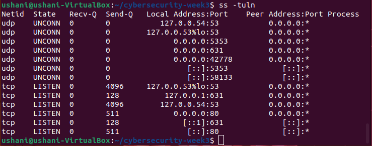

### Observation

The following listening TCP/UDP ports were observed:

* **[53]**
* **[631]**
* **[80]**

### What I Learned

I learned that listening ports can reveal which network services are waiting for incoming connections. This makes `ss -tuln` useful during a basic security assessment.

---

## 9. `df -h`

### Command

```bash
df -h
```

### Purpose

The `df -h` command displays filesystem disk-space usage in a human-readable format.

### Output

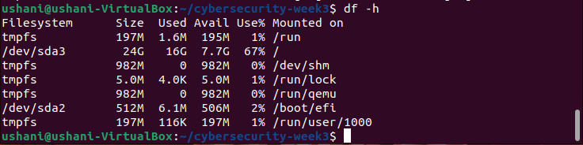

### Observation

The filesystem had approximately:

* Total space: **[197M]**
* Used space: **[1.6M]**
* Available space: **[195M]**

### What I Learned

I learned that `df -h` can be used to monitor available disk space. Low disk space can affect system availability and may also interfere with logging and normal system operation.

---

## 10. `free -h`

### Command

```bash
free -h
```

### Purpose

The `free -h` command displays information about memory and swap usage in a human-readable format.

### Output

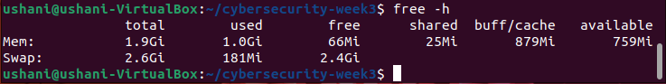

### Observation

The system had approximately **[1.9Gi]** of total memory and **[759Mi]** available memory.

### What I Learned

I learned that `free -h` can be used to monitor RAM and swap usage and understand the current memory state of a Linux system.

---

## 11. Running Services

### Command

```bash
systemctl --type=service --state=running
```

### Purpose

This command lists services that are currently running on the Ubuntu system.

### Output

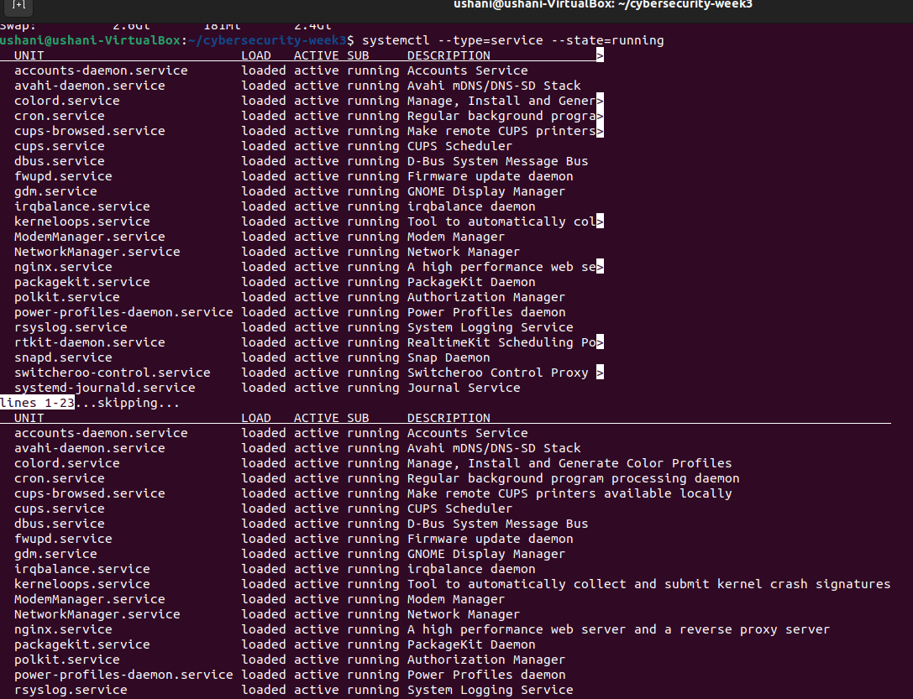
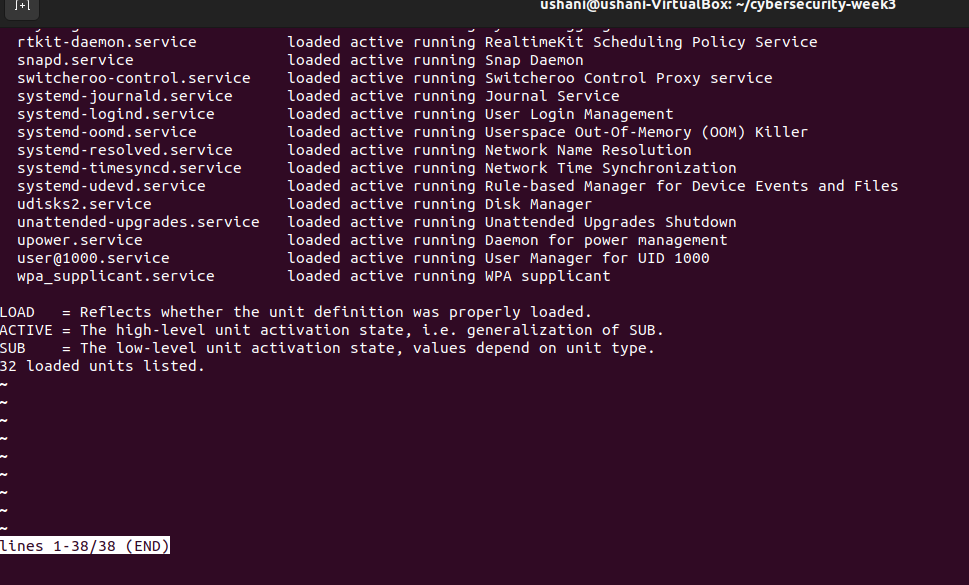
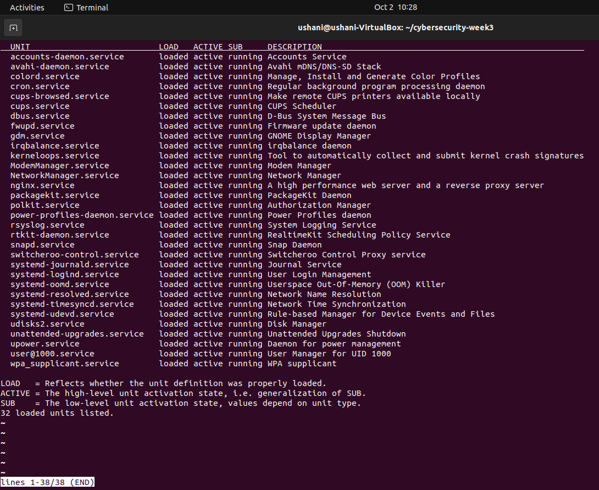

### Observation

Several services were running on the system. Examples I observed were:

* **[accounts-daemon.service]**
* **[avahi-daemon.service]**
* **[colord.service]**
* **[cron.service]**

These services provide different operating-system functions.

### What I Learned

I learned that `systemctl` can be used to investigate the current state of system services. Running services should be understood because they can provide functionality and, when network-facing, may expose additional attack surfaces.

---

## 12. `journalctl -n 50`

### Command

```bash
journalctl -n 50
```

### Purpose

The `journalctl -n 50` command displays the 50 most recent entries from the system journal.

### Output

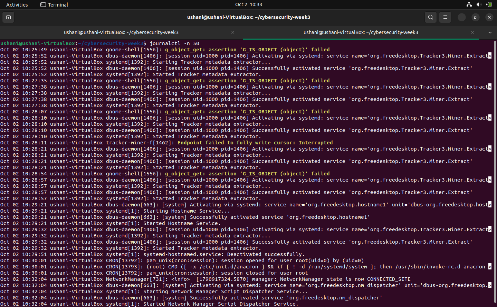

### Observation

The recent log entries contained information such as:

* Timestamp: **[Oct 02 10:25:52]**
* Process/service: **[systemd]**
* Message: **[Started Tracker metadata extracter.]**


### What I Learned

I learned that `journalctl` can be used to inspect recent system activity and investigate events generated by system services and processes.

---

## 13. `journalctl -p warning -n 30`

### Command

```bash
journalctl -p warning -n 30
```

### Purpose

This command displays recent journal entries with warning priority and higher.

### Output

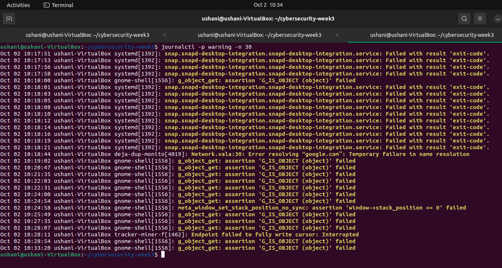

### Observation

I observed the following relevant log information:

* Timestamp: **[Oct 02 10:17:51]**
* Process/service: **[systemd]**
* Message: **[snap.snapd-desktop-integration.snapd-desktop-integration.service: Failed with result 'exit-code']**

### What I Learned

I learned that system logs can provide useful information when investigating the state and behaviour of a Linux system. A warning does not automatically indicate a security incident; it needs to be interpreted in context.

---

# Command Summary

| Command      | Main Purpose                     | Security Relevance                  |
| ------------ | -------------------------------- | ----------------------------------- |
| `whoami`     | Identify current user            | Establishes user identity           |
| `pwd`        | Show current directory           | Identifies filesystem location      |
| `ls -la`     | List files and permissions       | Helps inspect access permissions    |
| `id`         | Show UID, GID and groups         | Helps understand user privileges    |
| `ip addr`    | Show interfaces and IP addresses | Identifies network configuration    |
| `ip route`   | Show routing table               | Identifies network routes           |
| `ps aux`     | Show running processes           | Helps investigate system activity   |
| `ss -tuln`   | Show listening sockets           | Identifies exposed network services |
| `df -h`      | Show disk usage                  | Helps monitor system availability   |
| `free -h`    | Show memory usage                | Helps monitor system resources      |
| `systemctl`  | Show running services            | Helps identify active services      |
| `journalctl` | Show system logs                 | Helps investigate system events     |

---

# Overall Learning

During this practical exercise, I learned how Linux command-line tools can be used to investigate the current state of a system.

I learned how to identify the current user and group memberships, inspect files and permissions, determine the IP address and default route, investigate running processes and services, identify listening network ports, check disk and memory usage, and inspect recent system logs.

These commands provide a basic system-observation and security-investigation workflow. They can help establish a baseline of what is running on a Linux system and provide information that can be investigated further when unusual activity is observed.

---

# Conclusion

The Week 3 Linux Foundations practical improved my understanding of Linux system investigation from the command line. The exercises demonstrated that information about users, network configuration, processes, services, ports, resources, file permissions, and logs can be collected using standard Linux commands.
